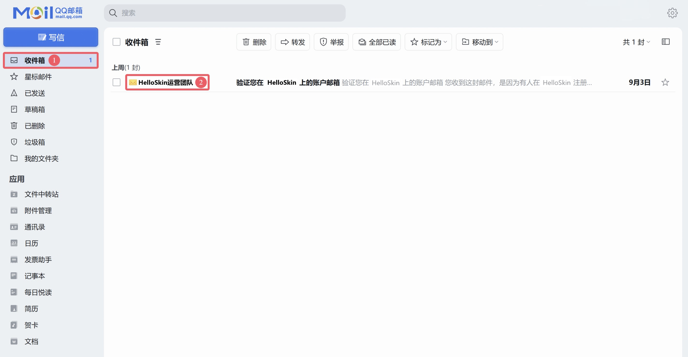

# 验证邮箱

欢迎加入 HelloSkin

看到此处，你应该已经成功注册了 HelloSkin 账号！🎉🎉

但你离进入游戏的过程还差最后一步：验证你的邮箱。

## 以 QQ 邮箱为例

1. 打开 [QQ 邮箱官网](https://mail.qq.com) 页面并登录你的 QQ 账号，打开 **收件箱** 后查看发件人为 **HelloSkin运营团队** 的邮件
   

   [😢 收不到验证邮件？](../faq/site#no-email)
   前去查看关于验证邮件无法收到的解决办法

2. 点击以 **HelloSkin运营团队** 为发件人的邮件，然后点击邮件里的链接进入 HelloSkin 的邮箱验证页面

   > [!IMPORTANT] 注意
   >
   > - 请始终使用浏览器访问邮件中的链接。
   > - 从手机 QQ 或 QQ 邮箱 APP 内置的浏览器中直接访问链接可能会产生错误。
   > - 请认准 **发件人** 为 **HelloSkin运营团队 (no_reply@helloskin.cn)** 的邮件，谨防诈骗邮件。

3. 输入你注册 HelloSkin 时提供的邮箱，然后点击 <BSSection>提交</BSSection> 按钮

4. 大功告成 🎉

至此，大功告成，Enjoy it！

## 其他邮件网页版/客户端

与上述操作相似，请在各自邮箱提供商的网页或 APP 的 **收件箱** 和 **垃圾箱** 寻找由 **HelloSkin** 发出的验证邮件。

---

[😢 忘记密码了怎么办？](../faq/site.md#reset-password)
前去了解如何重置自己的密码
